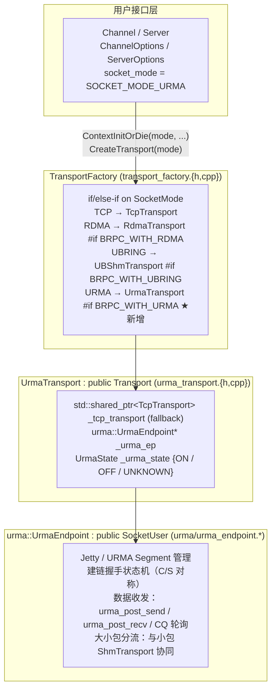
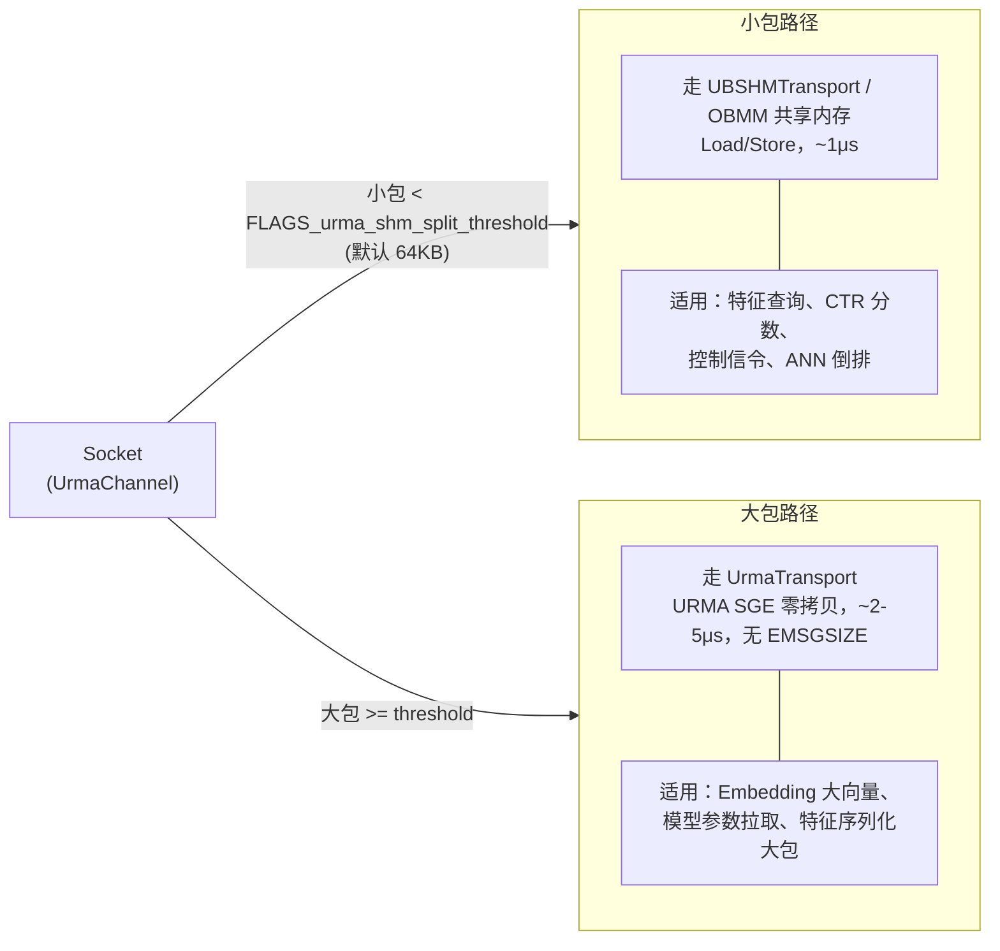
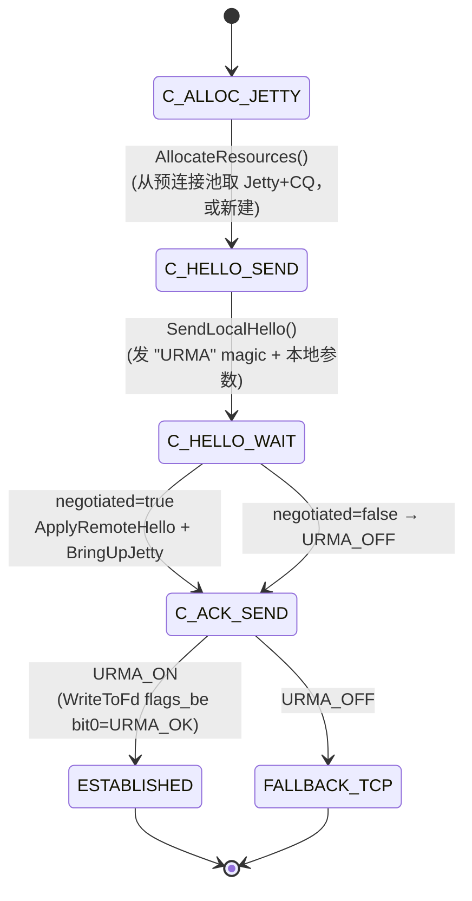
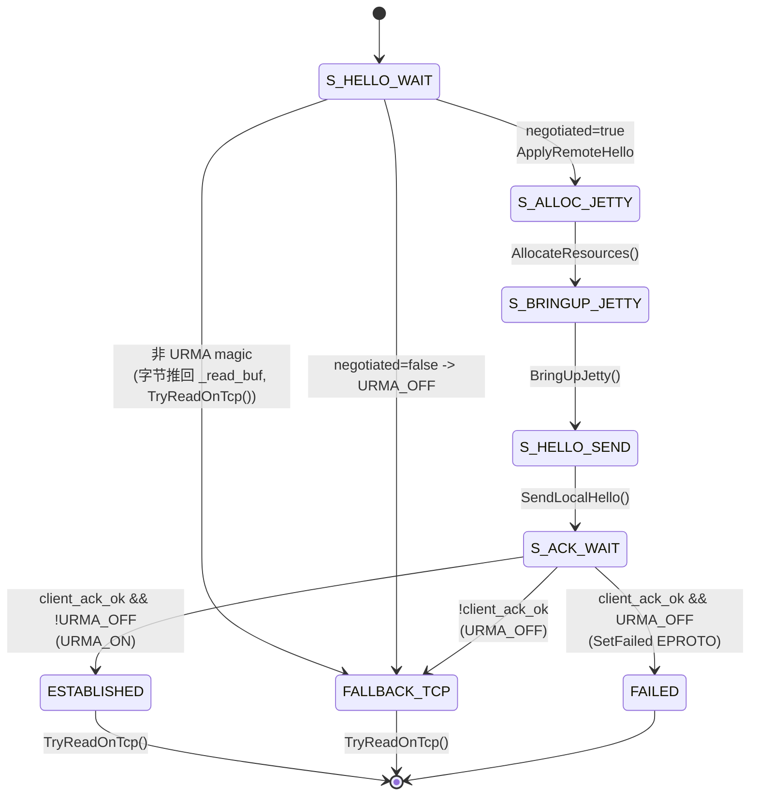
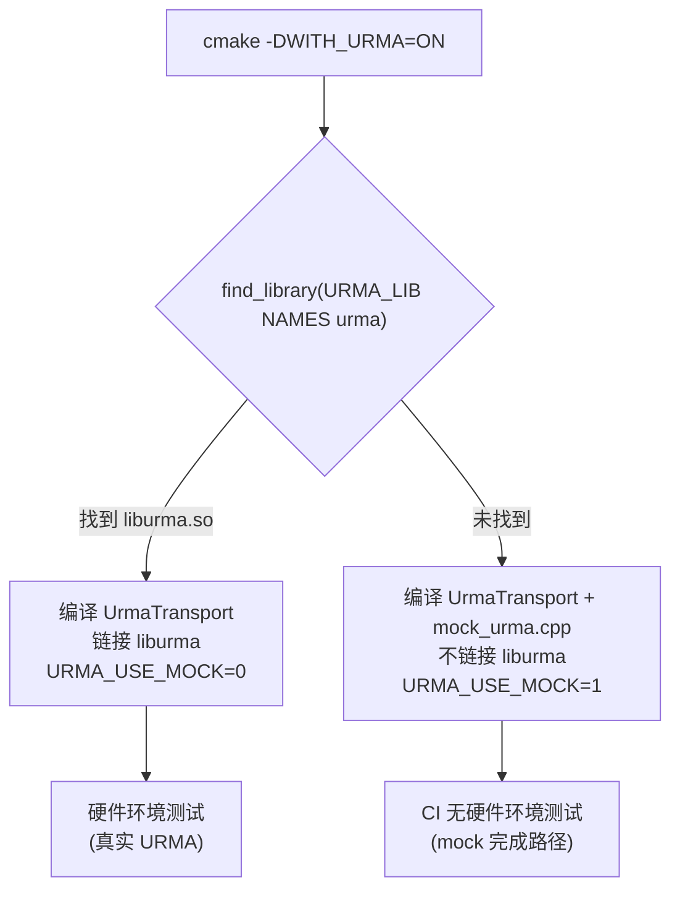

# UrmaTransport 提案：基于 openEuler URMA 的远程内存语义传输层

> 关联讨论：
> - [#3167 brpc支持传输层多协议改进建议](https://github.com/apache/brpc/issues/3167) —— Socket-Transport 架构改造共识
> - [#3217 openEuler总线协议 urma 和 obmm 技术路线讨论](https://github.com/apache/brpc/discussions/3217) —— 路线 B（URMA-UrmaTransport）与路线 C（双后端）共识
> - [#3226 基于UB协议OBMM共享内存Transport方案设计](https://github.com/apache/brpc/issues/3226) —— OBMM/ShmTransport 实现方案
>
> 本提案对应 #3217 中的**路线 B**，并与 #3226 的 OBMM-ShmTransport 形成**路线 C（双后端协同）**。

## 1. 背景与动机

### 1.1 现有传输层的局限

brpc 当前内置三种传输层（`SOCKET_MODE_TCP` / `SOCKET_MODE_RDMA` / `SOCKET_MODE_UBRING`），均通过 #3167 落地的 `Transport` 抽象接入：

| 传输层 | 访问语义 | 单跳延迟 | 连接模型 | 适用场景 |
|--------|----------|----------|----------|----------|
| TCP | Socket API（字节流） | ~50μs | 5-tuple | 广域网/局域网 |
| RDMA | Verbs API（异步） | ~2-5μs | RC-QP（每连接一个 QP） | 数据中心，`baidu_std` 协议 |
| UBRing | Load/Store（共享内存） | ~500ns | 共享内存环 | 同机 IPC / UBS-Mem 跨节点 |

三者各有边界，但在以下场景仍存在缺口：

1. **RDMA 的 QP 爆炸**：RC 模型下每条逻辑连接占用一个 QP，千级节点规模下 QP 数量达百万级，耗尽网卡片上 SRAM，触发 QP 状态 Cache Miss，延迟从 ~12μs 跳变至 ~300μs。
2. **RDMA 的控制面/数据面资源争用**：内存注册/注销与数据面竞争网卡内部资源，高并发下性能抖动。
3. **RDMA 编程模型笨重**：`准备 WQE → Doorbell → 轮询 CQE` 的异步流程在小包（数百字节）场景下，WQE 构建开销占比可达 17.8%。
4. **UBRing 的跨节点能力受限**：当前跨节点依赖 UBS-Mem（`ub_shm_type=2`），需要额外 `libubsm_sdk.so`；其 64 字节定长分块（60B payload + 4B header）对大包不友好，单消息上限受 `data_queue_size` 约束（超限返回 `EMSGSIZE`）。
5. **大包/小包协同缺失**：UBRing 对小包极优（亚微秒、零系统调用），但大包要切分成 ~17k 个 64 字节块逐块拷贝；RDMA 对大包友好（直接 SGE 零拷贝），但小包开销高。目前两者各自独立，无法在一个连接内按包大小自动选择最优路径。

### 1.2 URMA 是什么

[URMA（Unified Remote Memory Access）](https://atomgit.com/openeuler/umdk)是 openEuler 在 UB（Unified Bus）总线上提供的用户态远程内存访问 SDK，核心特性：

- **无连接 UM（Unreliable Datagram）语义**：驱动内置重传/CRC，可靠且免 RC-QP 爆炸——**单 Jetty 可打 N 个远端**，连接数为 O(N) 而非 O(N×线程数)。
- **统一内存操作语义**：单边（`URMA_OP_SEND`/`URMA_OP_READ`/`URMA_OP_WRITE`）、双边、原子操作通过同一套 `urma_post_send/recv` API 实现，**RoCE v2 / InfiniBand / PCIe P2P 三种底层统一对接**。
- **URMA-SHM 模式**：远端映射同一物理页，本机与跨机共享内存统一访问，天然适配 `one2all` 场景。
- **Jetty 流控**：硬件级流控替代 RDMA 的 PFC/ECN，避免拥塞丢包。

性能定位（引用 #3217 实测口径）：

| 技术方案 | 访问方式 | 单跳延迟 | 编程模型 | 缓存一致性 | 适用边界 |
|----------|----------|----------|----------|------------|----------|
| RDMA | Verbs API（异步） | ~2-5μs | Read/Write/Send | 无（需软件同步） | 数据中心 |
| URMA | Segment API（异步） | ~2-5μs | Read/Write | 可选硬件一致性 | 超节点 |
| OBMM | Load/Store | ~几百ns | 直接内存访问 | 可选 NC 和 CC 两种 | 超节点 |

### 1.3 本提案的目标

**面向超节点（UB 总线互联的 CPU/GPU 集群）场景，新增一个 UrmaTransport，作为 RDMA 在 UB 场景的对等替代与升级**：

1. **性能对标 RDMA**：在 RoCE/IB 底层上达到与现有 `RdmaTransport` 同量级延迟（~2-5μs），并通过 UM 语义消除 QP 爆炸。
2. **与 UBSHMTransport 大小包协同**：复用 #3226 的 OBMM-ShmTransport 小包极速路径，由 UrmaTransport 承接大包/跨节点高吞吐路径，运行时按包大小与拓扑自动选择（路线 C）。
3. **复用现有 Transport 框架**：完全沿用 #3167 落地的 `Transport` / `TransportFactory` / `SocketMode` 抽象，不侵入 `Socket`/`InputMessenger`/协议层。
4. **平滑落地**：参考 `RdmaTransport` 的「compose TcpTransport + tri-state 协商 + TCP fallback」模式，保证未启用/对端不支持时透明回退 TCP。

## 2. 总体架构

### 2.1 在 brpc 中的位置



UrmaTransport 与 `RdmaTransport`、`UBShmTransport` 并列为第四种 `Transport` 实现，对外行为完全一致：用户只需把 `socket_mode` 设为 `SOCKET_MODE_URMA`，其余 brpc API（`Channel`/`Server`/`Controller`/`baidu_std` 协议）零改动。

### 2.2 核心类设计

完全沿用 RDMA/UBShm 已验证的两层结构（Transport + Endpoint），保证代码风格与维护成本对齐：

| 类 | 文件 | 职责 | 参考 |
|----|------|------|------|
| `brpc::UrmaTransport` | `src/brpc/urma_transport.{h,cpp}` | `Transport` 子类；持有 `UrmaEndpoint*` + fallback `TcpTransport`；三态 `URMA_ON/OFF/UNKNOWN`；`ContextInitOrDie` 校验协议/SSL | `rdma_transport.{h,cpp}` / `ubshm_transport.{h,cpp}` |
| `urma::UrmaEndpoint` | `src/brpc/urma/urma_endpoint.{h,cpp}` | 每连接状态机；`SocketUser` 子类；`BAIDU_CACHELINE_ALIGNMENT`；Jetty/Segment 生命周期；CQ 轮询；收发数据路径 | `rdma/rdma_endpoint.{h,cpp}` |
| `urma::UrmaConnect : public AppConnect` | 同上 | 客户端握手驱动；`StartConnect` 起后台 bthread 跑 `ProcessHandshakeAtClient` | `RdmaConnect` / `UBConnect` |
| `urma::UrmaHandshake` | `src/brpc/urma/urma_handshake.{h,cpp}` | v2 二进制握手（`HelloMessage` Serialize/Deserialize + `ReadFromFd`/`WriteToFd`）；`ParsedHello` 中间结构；magic `"URMA"` 分发 | `rdma/rdma_handshake.{h,cpp}` |
| `urma::UrmaResource` | 同 endpoint | POD：`urma_jetty*`、`urma_cq*`、comp channel；预连接池 | `RdmaResource` |
| `urma::BlockPool`（复用） | `src/brpc/rdma/block_pool.{h,cpp}` | 内存注册池；UrmaTransport 复用 RDMA 已有的 `block_pool`（URMA 底层同为 verbs 风格注册） | 现有 |
| `urma::UrmaHelper` | `src/brpc/urma/urma_helper.{h,cpp}` | 全局初始化；`liburma` dlopen；设备/Jetty 管理 | `rdma/rdma_helper.{h,cpp}` |

**关键设计决策**（与 RDMA 对齐，便于复用与评审）：

1. **Compose TCP，不替换**：`UrmaTransport` 内嵌 `std::shared_ptr<TcpTransport>`，握手未完成/对端不支持/资源不可用时，所有数据路径方法回退到 TCP，保证现有 RPC 语义不破。
2. **三态协商**：`URMA_UNKNOWN → URMA_ON / URMA_OFF`，数据路径统一判断 `_urma_state != URMA_OFF`，与 RDMA 的 `RDMA_UNKNOWN/ON/OFF` 完全对称。
3. **Send/Recv + Immediate**：采用 `URMA_OP_SEND_WITH_IMM`（对应 `IBV_WR_SEND_WITH_IMM`），32-bit immediate 携带 recv-WR ack 数，实现 piggyback 流控，避免额外控制报文。不使用单边 RDMA Write/Read 作为主路径，降低收端预注册缓冲的复杂度。
4. **双窗口 credit 流控**：`_remote_rq_window_size`（对端 recv 容量）+ `_sq_window_size`（本地 SQ 容量），均为 atomic；窗口耗尽返回 EAGAIN，`WaitEpollOut` 阻塞在 `_epollout_butex`。
5. **复用 `block_pool` + IOBuf allocator 劫持**：URMA 同为 verbs 风格，需要注册内存。直接复用 `src/brpc/rdma/block_pool.{h,cpp}` 与 `rdma_helper.cpp` 中 `butil::iobuf::blockmem_allocate` 的替换逻辑，避免重复造轮子。若内存池后端需区分，通过 `RegisterCallback` 注入 Urma 版本的 `UrmaRegisterMemory`。
6. **预连接 Jetty 池**：参考 `FLAGS_rdma_prepared_qp_cnt`（默认 1024），在 `GlobalUrmaInitializeOrDie` 时预分配 Jetty+CQ 集合，连接时从池中取，断开后 RESET 回收。
7. **dlopen `liburma.so`**：参考 `rdma_helper.cpp::ReadRdmaDynamicLib`，运行时 `dlopen` + `dlsym` 解析 `urma_*` 符号，未启用时 `#else` 提供空 stub，保证非 URMA 构建干净。

### 2.3 大小包协同：路线 C 的关键

这是本提案相对于 #3226 OBMM 方案的**核心增量价值**。UBShmTransport（#3226）在 64 字节定长块上对小包极优，但对大包存在 `EMSGSIZE` 上限和 ~17k 块拷贝开销。UrmaTransport 通过 URMA 的 SGE 零拷贝对大包友好。两者协同设计：



**协同实现方式（两选一，倾向方案 A，留待社区讨论）**：

**方案 A：应用层显式选择（推荐先行落地）**
- 用户在 `ChannelOptions` 中显式为不同服务选择 `socket_mode`：小包服务用 `SOCKET_MODE_UBRING`，大包服务用 `SOCKET_MODE_URMA`。
- 不引入跨 transport 的连接复用复杂度，符合 brpc「一个 Socket 一种 transport」的既有不变量（见 §3.3 of the RDMA 探索报告：A given Socket is bound to exactly one transport for its lifetime）。
- 落地快、改动小、可测、可回退。

**方案 B：单连接内按包分流（远期演进，本提案不立即实现）**
- 新增 `SOCKET_MODE_HYBRID_UB_URMA`，`HybridTransport` 内部同时持有 `UBShmEndpoint` 与 `UrmaEndpoint`。
- `CutFromIOBufList` 根据 `IOBuf` 总长度路由：小包走 SHM ring，大包走 URMA send。
- 需要解决：双 Socket 生命周期、双握手、双 CQ 轮询、`_read_buf` 归并解析、`WaitEpollOut` 双路径唤醒。复杂度高，建议方案 A 稳定后再议。
- 对应 #3217 路线 C「单后端自动切换」。

**本提案先交付方案 A 的 UrmaTransport 主体**，并在文档中明确小包场景建议使用 `SOCKET_MODE_UBRING`（#3226），形成路线 C 的「双后端各司其职」格局。方案 B 作为后续演进方向记录。

## 3. 与 brpc 架构的结合

### 3.1 Transport 接口实现映射

`Transport` 基类（`src/brpc/transport.h`）定义了 10 个纯虚方法。下表给出 `UrmaTransport` 每个方法的实现要点，及其与 `RdmaTransport` 的对应关系：

| `Transport` 虚方法 | `UrmaTransport` 实现 | RDMA 对照 |
|---|---|---|
| `Init(socket, options)` | 构造 `UrmaEndpoint(socket)`；创建 fallback `TcpTransport`；若 `options.socket_mode == SOCKET_MODE_URMA` 则设 `_on_edge_trigger = urma::UrmaEndpoint::OnNewDataFromTcp` | `RdmaTransport::Init` |
| `Release()` | `delete _urma_ep`；释放 Jetty/CQ 资源回预连接池 | `RdmaTransport::Release` |
| `Reset(expected_nref)` | `UrmaEndpoint::Reset()`：Jetty 置 RESET，CQ drain，状态回 `UNINIT`，窗口计数器归零 | `RdmaEndpoint::Reset` |
| `Connect()` | 返回 `std::make_shared<urma::UrmaConnect>()`（或用户 `_default_connect`） | `RdmaTransport::Connect` |
| `CutFromIOBuf(buf)` | `_urma_ep && _urma_state != OFF` → `_urma_ep->CutFromIOBufList({buf},1)`；否则 `_tcp_transport->CutFromIOBuf(buf)` | `RdmaTransport::CutFromIOBuf` |
| `CutFromIOBufList(bufs,n)` | URMA send 路径：构建 SGE → `urma_post_send` → 窗口扣减；EAGAIN 时返回 -1 | `RdmaEndpoint::CutFromIOBufList` |
| `WaitEpollOut(butex,pollin,dt)` | `URMA_ON` 且 `!IsWritable()` → `butex_wait(_epollout_butex)`；否则委托 TCP。注意 URMA 同样无法靠 write 探测失败，wait 后需重检 `_socket->Failed()` | `RdmaTransport::WaitEpollOut` |
| `ProcessEvent(attr)` | 与 TCP 版本一致：把 `OnEdge(socket)` 调度到 bthread | `RdmaTransport::ProcessEvent` |
| `QueueMessage(msg,n,last)` | 与 TCP 版本一致；尊重 `FLAGS_urma_use_polling`/`FLAGS_urma_disable_bthread` | `RdmaTransport::QueueMessage` |
| `Debug(os)` | 输出 `UrmaEndpoint::DebugInfo`（状态、Jetty、窗口大小、索引） | `RdmaTransport::Debug` |

数据路径流向（与 RDMA 完全一致，便于评审对照）：

```mermaid
flowchart TD
    subgraph Write["写路径"]
        W1["Socket::DoWrite"] --> W2["UrmaTransport::CutFromIOBufList"]
        W2 --> W3["UrmaEndpoint::CutFromIOBufList"]
        W3 --> W4["构建 ibv_sge<br/>(从 IOBuf block refs + block_pool lkey)"]
        W4 --> W5["urma_post_send(JETTY,<br/>wr=SEND_WITH_IMM, imm=ack_count)"]
        W5 --> W6{"窗口扣减"}
        W6 -->|窗口满| W7["EAGAIN -> WaitEpollOut 阻塞"]
    end
    subgraph Read["读路径"]
        R1["URMA CQ comp-channel fd<br/>epoll 触发"] --> R2["Transport::ProcessEvent -><br/>OnEdge -> _on_edge_trigger"]
        R2 --> R3["UrmaEndpoint::PollCq -> ibv_poll_cq"]
        R3 --> R4["HandleCompletion"]
        R4 -->|"SEND"| R5["回收 SQ 窗口<br/>WakeAsEpollOut"]
        R4 -->|"RECV"| R6["cutn 进 _socket->_read_buf<br/>(zerocopy 阈值)"]
        R6 --> R7["imm -> 补 _remote_rq_window_size<br/>PostRecv(1) + SendAck(1)"]
        R7 --> R8["InputMessenger::ProcessNewMessage<br/>(协议解析与 TCP 完全一致)"]
    end
```



### 3.2 注册机制（三处改动，完全沿用 RDMA 模板）

参考探索结论：brpc 无动态注册，新 transport 需改三处：

1. **`src/brpc/socket_mode.h`** — 新增枚举：
```cpp
enum SocketMode {
    SOCKET_MODE_TCP   = 0,
    SOCKET_MODE_RDMA  = 1,
    SOCKET_MODE_UBRING = 2,
    SOCKET_MODE_URMA  = 3   // 新增
};
```

2. **`src/brpc/transport_factory.cpp`** — 两处 `if/else-if`，`#if BRPC_WITH_URMA` 守卫：
```cpp
int TransportFactory::ContextInitOrDie(SocketMode mode, bool serverOrNot, const void* _options) {
    if (mode == SOCKET_MODE_TCP) { return 0; }
#if BRPC_WITH_RDMA
    else if (mode == SOCKET_MODE_RDMA) { return RdmaTransport::ContextInitOrDie(serverOrNot, _options); }
#endif
#if BRPC_WITH_UBRING
    else if (mode == SOCKET_MODE_UBRING) { return UBShmTransport::ContextInitOrDie(serverOrNot, _options); }
#endif
#if BRPC_WITH_URMA
    else if (mode == SOCKET_MODE_URMA) { return UrmaTransport::ContextInitOrDie(serverOrNot, _options); }
#endif
    ...
}

std::unique_ptr<Transport> TransportFactory::CreateTransport(SocketMode mode) {
    ...
#if BRPC_WITH_URMA
    else if (mode == SOCKET_MODE_URMA) {
        return std::unique_ptr<UrmaTransport>(new UrmaTransport());
    }
#endif
}
```

3. **`CMakeLists.txt`** — 新增 option 与宏：
```cmake
option(WITH_URMA "With URMA (openEuler Unified Remote Memory Access)" OFF)
if(WITH_URMA)
    set(BRPC_WITH_URMA 1)
    # liburma 由 dlopen 加载，无需 link；可选 link libumdk
    list(APPEND BRPC_PUBLIC_LIBS ${URMA_LIB})
endif()
```

所有 `urma*` 源文件统一 `#if BRPC_WITH_URMA ... #else <stub> #endif`，非启用构建零侵入（与 RDMA/UBRing 一致）。

### 3.3 建链握手（双平面：TCP 控制 + URMA 数据）

沿用 RDMA/UBShm 已验证的**「TCP 控制面 + 原生数据面」双平面**模式，避免重新发明轮子：

- **控制面**：复用 brpc 现有的 TCP connect + `AppConnect` 钩子。TCP 连接建立后，`Socket::CheckConnectedAndKeepWrite` 调用 `_app_connect->StartConnect`，在后台 bthread 跑 URMA 握手。
- **数据面**：握手成功后切换到 URMA Jetty 收发，TCP fd 仅保留用于 epoll 生命周期与 fallback。

**客户端状态机**（`ProcessHandshakeAtClient`，参考 `RdmaEndpoint::ProcessHandshakeAtClient`）：



**服务端状态机**（`ProcessHandshakeAtServer`，由 `_on_edge_trigger = OnNewDataFromTcp` 在首次可读时拉起）：



4 字节 ACK `URMA_OK=0x1` 为最终共识位，双端独立决策后确认，不一致即硬错误。与 RDMA 的 `HELLO_ACK_RDMA_OK` 完全对称。

握手 IO 复用 `ReadFromFd`/`WriteToFd`（EAGAIN 感知循环，`_read_butex` 等待 + 50ms `WAIT_TIMEOUT_MS`），直接照搬 `rdma_endpoint.cpp:316-421`。

### 3.4 CQ 作为第二个 Socket

URMA 每连接需要一个额外可 poll 的 fd（CQ comp-channel，或 polling 模式下的 carrier）。参考 `RdmaEndpoint::AllocateResources`（`rdma_endpoint.cpp:1159-1178`）的成熟做法：

- 创建第二个 brpc `Socket`，其 `fd` 为 CQ comp-channel fd，`options.user = this`（即 `UrmaEndpoint`），`options.on_edge_triggered_events = PollCq`。
- 释放时 `SetFailed()` 该 CQ socket 并清 `_user`，避免 endpoint 被双重释放（参考 `rdma_endpoint.cpp:1370-1380`）。
- Polling 模式下，参考 `PollerGroup`/`Poller`（每 bthread tag 一组），`FLAGS_urma_poller_num` 个轮询 bthread 循环遍历注册的 CQ socket id。

### 3.5 内存管理

URMA 底层为 verbs 风格，内存需注册。**直接复用 RDMA 的 `block_pool`**（`src/brpc/rdma/block_pool.{h,cpp}`），避免维护两套 slab 池：

- `block_pool` 的 `RegisterCallback` 注入 `UrmaRegisterMemory`（使用 `IBV_ACCESS_LOCAL_WRITE | IBV_ACCESS_RELAXED_ORDERING`，失败回退 `LOCAL_WRITE`，与 `RdmaRegisterMemory` 一致）。
- `UrmaHelper::GlobalUrmaInitializeOrDieImpl` 中同样劫持 `butil::iobuf::blockmem_allocate` → `BlockAllocate`，使所有 IOBuf block 天然 URMA 可用（参考 `rdma_helper.cpp:584-587`）。
- 用户态注册内存：复用 `RegisterMemoryForRdma`/`DeregisterMemoryForRdma`/`GetLKey`（在 `block_pool` 的 `g_user_mrs` 表中），或新增 `urma::*` 别名包装以命名清晰。

> **讨论点**：URMA 与 RDMA 是否共享同一个 `block_pool` 实例？若同进程内 RDMA 与 URMA 同时启用（一般不会），需评估设备间 lkey 命名空间。初步建议：单进程二选一，由 `ContextInitOrDie` 校验互斥。

## 4. 关键接口与配置

### 4.1 用户接口

```cpp
// 客户端
brpc::ChannelOptions opt;
opt.socket_mode = brpc::SOCKET_MODE_URMA;   // 选择 UrmaTransport
opt.protocol = "baidu_std";                  // URMA 仅支持 baidu_std（同 RDMA）
channel.Init("127.0.0.1:8000", &opt);

// 服务端
brpc::ServerOptions sopt;
sopt.socket_mode = brpc::SOCKET_MODE_URMA;
server.Start(port, &sopt);
```

`OptionsAvailableForUrma` / `OptionsAvailableOverUrma` 校验：拒绝 SSL、RTMP、NSHEAD、MONGO；仅允许 `baidu_std` 协议（与 `SupportedByRdma` 对齐）。

### 4.2 gflags（对照 RDMA 命名，`urma_*` 前缀）

| Flag | 默认 | 文件 | 用途 |
|------|------|------|------|
| `--urma_max_sge` | 0 | `urma_helper.cpp` | 每 WR SGE 上限；0=设备上限 |
| `--urma_device` | "" | `urma_helper.cpp` | URMA 设备名；空=首个活跃 |
| `--urma_sq_size` | 128 | `urma_endpoint.cpp` | 每连接 SQ 深度（[16,4096]） |
| `--urma_rq_size` | 128 | `urma_endpoint.cpp` | 每连接 RQ 深度 |
| `--urma_prepared_jetty_cnt` | 1024 | `urma_endpoint.cpp` | 预连接 Jetty 池大小 |
| `--urma_cqe_poll_once` | 32 | `urma_endpoint.cpp` | 每次 `ibv_poll_cq` 上限 |
| `--urma_recv_zerocopy` | true | `urma_endpoint.cpp` | 接收零拷贝开关 |
| `--urma_zerocopy_min_size` | 512 | `urma_endpoint.cpp` | 零拷贝阈值（小于则拷贝） |
| `--urma_use_polling` | false | `urma_endpoint.cpp` | 轮询 vs 事件模式 |
| `--urma_poller_num` | 1 | `urma_endpoint.cpp` | 每 bthread tag 轮询器数 |
| `--urma_poller_yield` | false | `urma_endpoint.cpp` | 轮询循环 `bthread_yield` |
| `--urma_disable_bthread` | false | `urma_endpoint.cpp` | 内联处理消息（不走 bthread） |
| `--urma_trace_verbose` | false | `urma_endpoint.cpp` | 握手详细日志 |
| `--urma_memory_pool_initial_size_mb` | 1024 | `block_pool.cpp` | 内存池初始大小（复用） |
| `--urma_memory_pool_max_regions` | 3 | `block_pool.cpp` | 内存池区域上限（硬上限16） |

### 4.3 与 UBSHMTransport 的协同约定

| 场景 | 建议 `socket_mode` | 理由 |
|------|---------------------|------|
| 同机 IPC（同主机进程间） | `SOCKET_MODE_UBRING` | Load/Store 亚微秒，零系统调用 |
| 超节点跨机小包（<64KB，特征/分数/控制） | `SOCKET_MODE_UBRING`（`ub_shm_type=2` UBS-Mem）或 `SOCKET_MODE_URMA` | 两者均优；UBRing 更低延迟 |
| 超节点跨机大包（>=64KB，Embedding/参数） | `SOCKET_MODE_URMA` | SGE 零拷贝，无 `EMSGSIZE` |
| 传统 RoCE/IB 数据中心 | `SOCKET_MODE_URMA` 或 `SOCKET_MODE_RDMA` | URMA 统一语义，无 QP 爆炸 |

`--urma_shm_split_threshold`（默认 64KB）为方案 B（hybrid）预留 flag，方案 A 阶段仅作文档阈值参考。

## 5. 文件清单与改动范围

### 5.1 新增文件

```
src/brpc/
├── urma_transport.h          # UrmaTransport : public Transport
├── urma_transport.cpp
├── urma/
│   ├── urma_endpoint.h       # UrmaEndpoint : public SocketUser, UrmaConnect, UrmaResource
│   ├── urma_endpoint.cpp
│   ├── urma_helper.h         # 全局初始化, liburma dlopen, 设备管理
│   ├── urma_helper.cpp
│   ├── urma_handshake.h      # v2 二进制握手（HelloMessage + ParsedHello）
│   ├── urma_handshake.cpp
│   └── mock_urma.cpp          # URMA 链接时 mock（无 liburma 时编译，供 CI 测试）
docs/
├── cn/urma.md
└── en/urma.md
example/
└── urma_performance/
    ├── client.cpp
    └── server.cpp
test/
└── brpc_urma_unittest.cpp
```

### 5.2 修改文件

| 文件 | 改动 |
|------|------|
| `src/brpc/socket_mode.h` | 新增 `SOCKET_MODE_URMA = 3` |
| `src/brpc/transport_factory.{h,cpp}` | 两个 `if/else-if` 分支，`#if BRPC_WITH_URMA` 守卫 |
| `src/brpc/channel.h` | `ChannelOptions::socket_mode` 注释补充 URMA |
| `src/brpc/server.h` | `ServerOptions::socket_mode` 注释补充 URMA |
| `src/brpc/input_messenger.h` | `friend class urma::UrmaEndpoint;` |
| `CMakeLists.txt` | `option(WITH_URMA ...)` + `BRPC_WITH_URMA` 宏 + 源文件列表 |

### 5.3 复用文件（不改或最小改）

- `src/brpc/rdma/block_pool.{h,cpp}` — 内存注册池（`RegisterCallback` 注入 Urma 版本）
- `src/brpc/rdma/rdma_helper.cpp` — `blockmem_allocate` 劫持逻辑（提取为公共或 Urma 复制一份）
- `src/brpc/tcp_transport.{h,cpp}` — fallback 依赖

## 6. 落地计划

### Phase 1：框架与最小可用（本提案目标）
1. `SocketMode` + `TransportFactory` 注册通路。
2. `UrmaTransport` + `UrmaEndpoint` 骨架：三态、TCP fallback、握手状态机（v2 binary）。
3. 数据路径：`CutFromIOBufList` 走 `urma_post_send(SEND_WITH_IMM)`，`PollCq` + `HandleCompletion` 走 recv。
4. 复用 `block_pool`。
5. `example/urma_performance` 可跑通 `baidu_std` echo。
6. 单测 `brpc_urma_unittest.cpp`（参考 `brpc_rdma_unittest.cpp` 与新写的 `brpc_ubring_unittest.cpp`）。

### Phase 2：性能与协同
1. Polling 模式 + `PollerGroup` per-tag。
3. Unsignaled/solicited 完成抑制（降低 CPU）。
4. 与 UBSHMTransport 的大小包协同文档与示例（方案 A）。

### Phase 3：演进（留待社区讨论）
1. 方案 B：`SOCKET_MODE_HYBRID_UB_URMA` 单连接按包分流。
2. URMA-SHM 模式接入，与本机 UBRing 统一。
3. GPU memory 直接注册（`urma_register_memory` over HBM），对接 GPUDirect 类语义。

## 7. 风险与开放问题

1. **硬件/驱动依赖**：URMA 需要 openEuler UB 驱动 + `liburma`。非 UB 平台只能 fallback TCP。是否接受 ko 依赖已在 #3217 征询，本提案沿用其结论。**CI 无 URMA 硬件时的可测试性由 §7.1 的 mock 保证**。
2. **`block_pool` 复用边界**：URMA 与 RDMA 共享内存池的设备命名空间问题，倾向 `ContextInitOrDie` 互斥校验，需评审确认。
3. **URMA API 成熟度**：`urma_post_send`/`urma_post_recv` 与 verbs 的差异需在 `UrmaEndpoint` 适配层抹平（如 `ibv_sge` 是否复用、imm_data 位宽）。Phase 1 需先对齐 SDK 头文件。
4. **大小包协同方案选择**：方案 A（显式）vs 方案 B（自动分流）的取舍，请社区给出倾向。本提案默认先 A 后 B。
5. **`baidu_std` 协议限制**：与 RDMA 一致，暂不支持其他协议。若社区有 URMA over HTTP 等需求，后续议。
6. **跨平台**：URMA 当前为 Linux/openEuler 专有。macOS/Windows 提供 stub（同 RDMA/UBRing 的 `#else` 处理）。

### 7.1 URMA Mock：无硬件环境下的 CI 可测试性

**问题**：brpc 的 CI 运行在普通 Linux 容器中，没有 URMA 硬件/`liburma`。若 `WITH_URMA=ON` 时找不到 `liburma` 就 `FATAL_ERROR`，CI 无法构建和测试 UrmaTransport，回归风险高。

**方案**：在 brpc 中内置一个 **链接时替换（link-time substitution）** 的 URMA mock。



**Mock 设计**（`src/brpc/urma/mock_urma.cpp`，Mooncake 同款模式）：

| 设计点 | 实现 |
|--------|------|
| 替换方式 | **链接时**：mock 定义与 `liburma.so` 完全同名的 `urma_*` 自由函数符号，链接器按链接顺序选择 mock |
| 对象存储 | 匿名命名空间内 `std::map<opaque_ptr*, int>` 注册表，按对象类型分表（`context_map`/`jfc_state_map`/`jfr_map`/`seg_map`/`jetty_map`/`target_jetty_map`） |
| 成员校验 | 每个 `delete_*` 检查 map 成员资格，误用返回 `URMA_EINVAL` 而非崩溃 |
| 完成路径 | 每个 posted send/recv WR 的 `user_ctx` 推入所属 JFC 的 FIFO，下次 `urma_poll_jfc` 返回 `URMA_CR_SUCCESS` |
| 数据搬运 | **不搬运 payload 字节**--mock 是控制面替身，仅驱动握手/状态机；CI 数据路径测试不校验 payload 内容 |
| 设备名契约 | `device->name == "mock_urma_device"`，测试用 `--urma_device=mock_urma_device` 匹配 |

**Mock 覆盖的 `urma_*` 符号**（brpc transport 实际调用的全集）：

```
urma_init / urma_uninit
urma_get_device_list / urma_free_device_list / urma_get_device_by_name
urma_query_device / urma_get_eid_list / urma_free_eid_list
urma_create_context / urma_delete_context
urma_create_jfce / urma_delete_jfce
urma_create_jfc / urma_delete_jfc
urma_create_jfr / urma_delete_jfr
urma_register_seg / urma_unregister_seg
urma_import_seg / urma_unimport_seg
urma_create_jetty / urma_delete_jetty
urma_import_jetty / urma_unimport_jetty
urma_bind_jetty / urma_unbind_jetty / urma_modify_jetty
urma_post_jetty_send_wr       (send 路径)
urma_post_jfr_wr              (recv 路径，Mooncake mock 未含，brpc 新增)
urma_poll_jfc                  (完成轮询)
urma_get_async_event / urma_ack_async_event
```

> **与 Mooncake mock 的差异**：Mooncake 的 transport 是单边 write/read（仅 JFS），mock 不含 `urma_post_jfr_wr`。brpc 的 `UrmaEndpoint` 是双边 send/recv，recv 路径走 `urma_post_jfr_wr`，故 brpc mock 新增该函数--将 recv WR 的 `user_ctx` 推入 JFC 的 `pending_recv` 队列，`urma_poll_jfc` 先排空 send 完成再排空 recv 完成（`cr.flag.bs.s_r` 区分）。

**CMake 集成**（`CMakeLists.txt`）：

```cmake
if(WITH_URMA)
    find_library(URMA_LIB NAMES urma)
    if(URMA_LIB)
        message(STATUS "Found liburma: ${URMA_LIB}")
        set(URMA_USE_MOCK 0)
    else()
        message(WARNING "liburma not found; building UrmaTransport with the bundled mock.")
        set(URMA_USE_MOCK 1)
    endif()
endif()
# ... 源文件收集 ...
if(WITH_URMA AND NOT URMA_USE_MOCK)
    list(REMOVE_ITEM BRPC_SOURCES
         "${PROJECT_SOURCE_DIR}/src/brpc/urma/mock_urma.cpp")
endif()
# ... 链接 ...
if(WITH_URMA)
    if(NOT URMA_USE_MOCK)
        list(APPEND DYNAMIC_LIB ${URMA_LIB})
    endif()
endif()
```

**Mock 自身守卫**：`mock_urma.cpp` 包裹在 `#if BRPC_WITH_URMA ... #endif` 中，`WITH_URMA=OFF` 时不编译（与其它 URMA 源一致）。

**CI 保证**：

- `WITH_URMA=OFF`：所有 URMA 源编译为空 stub，mock 不参与编译，brpc 主库与现有行为一致。
- `WITH_URMA=ON` + 无 `liburma`（CI 默认）：mock 编译进 brpc，`brpc_urma_unittest` 链接 mock，跑通握手序列化/状态机/fallback 等纯逻辑测试。
- `WITH_URMA=ON` + 有 `liburma`（硬件环境）：mock 从源列表移除，链接真实 `liburma`，跑通真实 URMA 数据路径。

## 8. 与既有提案的关系

| 提案 | 关系 |
|------|------|
| #3167 | 本提案完全基于其落地的 `Transport` 抽象，不再讨论架构改造 |
| #3217 路线 B | 本提案即路线 B 的具体设计 |
| #3217 路线 C | 本提案 §2.3 给出方案 A（先行）+ 方案 B（演进），与 #3226 OBMM 形成 C |
| #3226 | OBMM-ShmTransport 为小包路径，本提案 UrmaTransport 为大包/跨节点路径，互补 |

## 9. 致谢

感谢 @chenBright @wwbmmm @yanglimingcn @ivanallen @dwh110 在 #3167 / #3217 / #3226 中的深入讨论，本提案在架构取舍上大量吸纳了这些讨论结论（尤其是 wwbmmm 关于「Transport 持有协议私有成员、Socket 只持 `_transport` 指针」的解耦思路，已成为现有 `Transport` 接口的设计基线）。

欢迎各位继续评审，特别是：
- 方案 A vs 方案 B 的倾向
- `block_pool` 复用 vs 独立
- URMA SDK API 与 verbs 的差异适配
- Phase 划分与落地节奏
